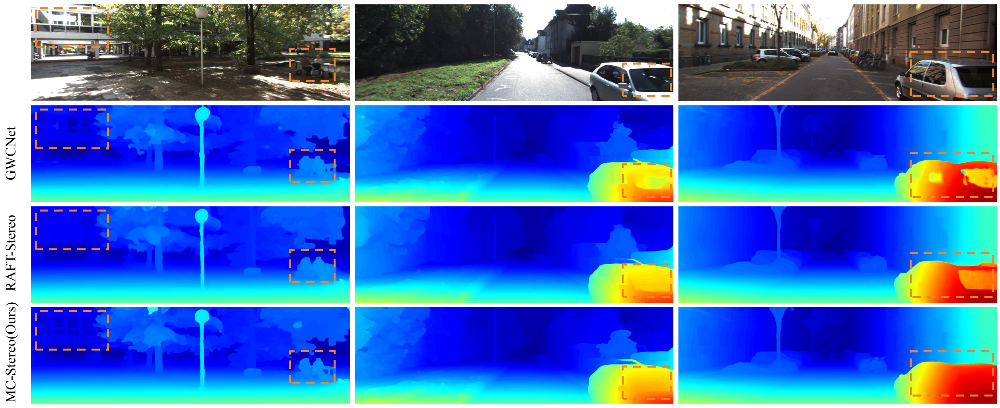

# MC-Stereo (3DV 2024)

This repository contains the source code for our paper:

[MC-Stereo: Multi-Peak Lookup and Cascade Search Range for Stereo Matching](https://arxiv.org/pdf/2311.02340.pdf)<br/>
Miaojie Feng, Junda Cheng, Hao jia, Longliang Liu, Gangwei Xu, Xin Yang<br/>


[//]: # ()

## Requirements
```
conda create -n MC_Stereo python=3.7
conda activate MC_Stereo
conda install pytorch==1.10.0 torchvision==0.11.0 torchaudio==0.10.0 cudatoolkit=11.3 -c pytorch -c conda-forge
pip install opencv-python
pip install scikit-image
pip install tensorboard
pip install tqdm
pip install timm==0.5.4
```

## Required Data
To evaluate/train MC-Stereo, you will need to download the required datasets.
* [Scene Flow](https://lmb.informatik.uni-freiburg.de/resources/datasets/SceneFlowDatasets.en.html)
* [KITTI](http://www.cvlibs.net/datasets/kitti/eval_scene_flow.php?benchmark=stereo)
* [ETH3D](https://www.eth3d.net/datasets#low-res-two-view-test-data)
* [CREStereo](https://github.com/megvii-research/CREStereo/tree/master)
* [InStereo2K](https://github.com/YuhuaXu/StereoDataset)

## Evaluation
To evaluate on Scene Flow, run
```Shell
sh evaluate.sh
```

## Training
To train on Scene Flow, run
```Shell
sh train_sceneflow.sh
```
To train on KITTI, run
```Shell
sh train_kitti.sh
```
To train on ETH3D, run
```Shell
sh train_eth3d.sh
```

## Submission
For submission to the KITTI benchmark, run
```Shell
python save_disp.py
```

## Citation
If you find our work useful in your research, please consider citing our paper:

```bibtex
@article{feng2023mc,
  title={MC-Stereo: Multi-peak Lookup and Cascade Search Range for Stereo Matching},
  author={Feng, Miaojie and Cheng, Junda and Jia, Hao and Liu, Longliang and Xu, Gangwei and Yang, Xin},
  journal={arXiv preprint arXiv:2311.02340},
  year={2023}
}
```

## Acknowledgements

This project is heavily based on [RAFT-Stereo](https://github.com/princeton-vl/RAFT-Stereo), We thank the original authors for their excellent work.

